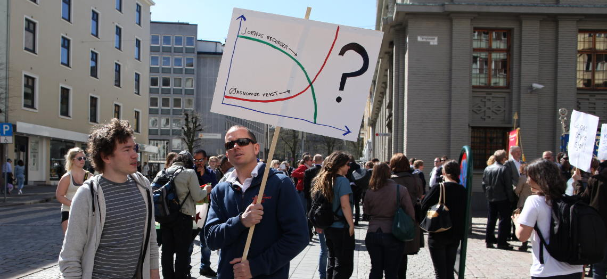

# Forsiden

    <ol class="carousel-indicators">
        <li data-target="#aboutCarousel" data-slide-to="0" class="active"></li>
        <li data-target="#aboutCarousel" data-slide-to="1"></li>
        <li data-target="#aboutCarousel" data-slide-to="2"></li>
        <li data-target="#aboutCarousel" data-slide-to="3"></li>
    </ol>

    

        

            
            

                <h3>Hvorfor</h3>
                

                Vår tid er unik. Like mye som den er kompleks er den også
                heftet med enorme utfordringer. Selv om det finnes mange som
                jobber for å fremme nye perspektiver, nye verdier og nye
                løsninger kan det virke som utviklingen ubønnhørlig drar i fra
                oss.
                

            

        

        

            
            

                <h3>Ulike arenaer, samme mål</h3>
                

                Bak ordet samfunnsomlafting står tanken om at alt filantropisk
                arbeid hører sammen. Utfordringer innenfor sosial
                rettferdighet, demokratisk inkludering, økologi, bærekraftig
                ressursforvaltning og naturvern kretser rundt like verdier og
                forståelse av samfunn.
                

            

        

        

            
            

                <h3>Samarbeid og samhold</h3>
                

                Foreningen for samfunnsomlafting sitt formål er derfor å fremme
                samarbeid og samhold mellom privatpersoner, organisasjoner og
                foretak som aktivt jobber for samfunnsendringer av filantropisk
                art.
                

            

        

        

            
            

                <h3>Foreningen</h3>
                

                Foreningen for samfunnsomlafting er en ideell, livsynsnøytral
                og partipolitisk uavhengig interesseorganisasjon for
                enkeltindivider som jobber for en bedre fremtid.
                

            

        

    

    <a class="left carousel-control" href="#aboutCarousel" data-slide="prev">
        
    </a>
    <a class="right carousel-control" href="#aboutCarousel" data-slide="next">
        
    </a>

