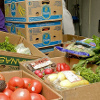

# Prosjekter

<a href="matsentralen.html" class="media">
    
    

        <h4 class="media-heading">Matsentralen</h4>
        

            Vårt første prosjekt i Bergen. Vi ønsker å forbedre ressursbruken i
            matnæringen ved å omdistribuere fortsatt brukbar mat som butikkene ikke
            lenger har lov å selge pga. datostempling.
        

    

</a>
