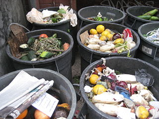
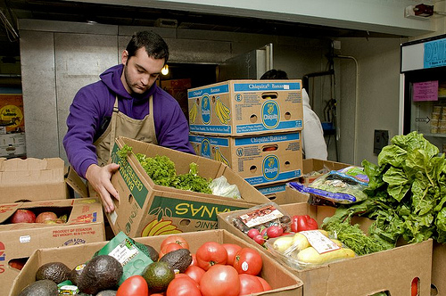

# Matsentralen

## Hvorfor en matsentral?

Over 100 000 tonn mat i året blir aldri kjøpt og havner rett i bosset. 250 000
tonn mat som blir kjøpt havner også i bosset hos forbrukeren. I mellomtiden
sulter én milliard mennesker globalt.

Det ligger et enormt forbedringspotensiale i hvordan vi forvalter våre
ressurser. Samtidig som vi forstår at butikkene må innfri til garantier og
regelverk, ser vi at mye av maten som går ut på «best før»-dato fortsatt kan
spises.

Det er ikke bare etiske eller moralske spørsmål som blir aktuelle når vi ser på
den mørke statistikken. Her er det også rom for økonomiske spørsmål. Hvor mye
penger bruker industrien på å kaste mat? Det ligger strenge føringer for
hvordan man kaster mat, det kan ikke bare kastes som restavfall. Det må store
og energikrevende ovner til for å trygt håndtere matavfall.

En matsentral kan ta i mot mat som ikke lenger kan selges, men som fortsatt kan
spises. Maten blir så redistributert til veiledige organisasjoner som gir maten
til fattige og trengende.

## Matsentral i Bergen

Vi ønsker å opprette en matsentral i Bergen. Foreløpig har vi kommet i gang med
et forprosjekt som blir gjennomført av en prosjektgruppe. Vi er bl.a. i dialog
med potensielle mottakere for å kartlegge lokale behov. April 2014 vant
prosjektet 200 000 kr fra Sparebanken Vest i arrangementet «Hjertebank for
Bergen», der 1 million kroner ble fordelt på fem prosjekter som «gjør Bergen
til en bedre by».

## Prosjektgruppe

Prosjektgruppen har som oppgave å få Matsentralen i gang og stå på egne bein. I
første omgang vil dette gjelde forprosjektet. Foreløpig består prosjektgruppen
av følgende medlemmer:

* Johnny fra Samlaft
* Rune fra Samlaft
* Per Rune fra Samlaft
* Adrian fra Samlaft
* Petter fra Fontenehuset
* Tore fra Blåkors

Vi vil gjerne ha med oss flere ildsjeler, så prosjektgruppen er åpen for flere
medlemmer tilknyttet relevante organisasjoner.

## Kontakt

* Johnny: 92 68 18 13 / nordstromjohnny *\[alfakrøll\]* gmail *\[dått\]* com
* Rune: 92 44 04 04 / rune *\[alfakrøll\]* storetvedt *\[dått\]* com
